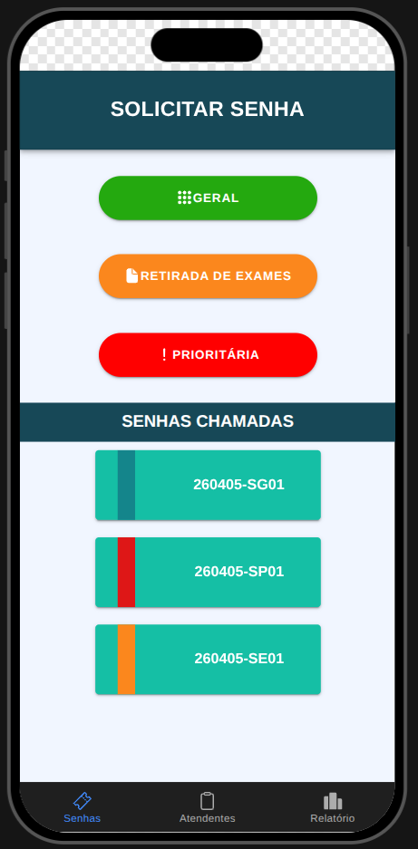
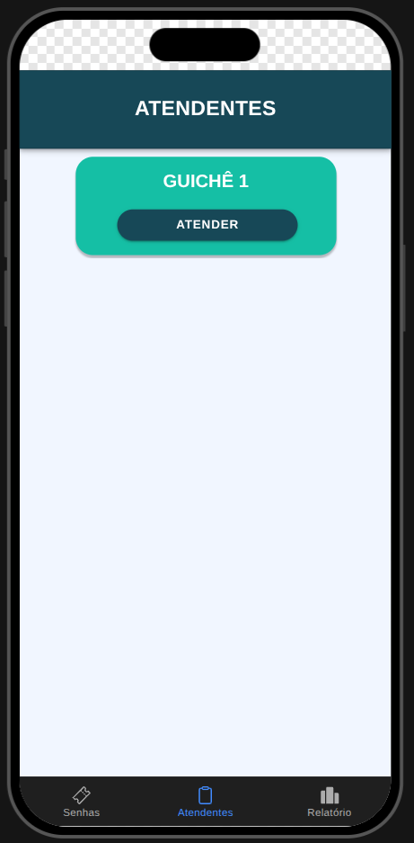
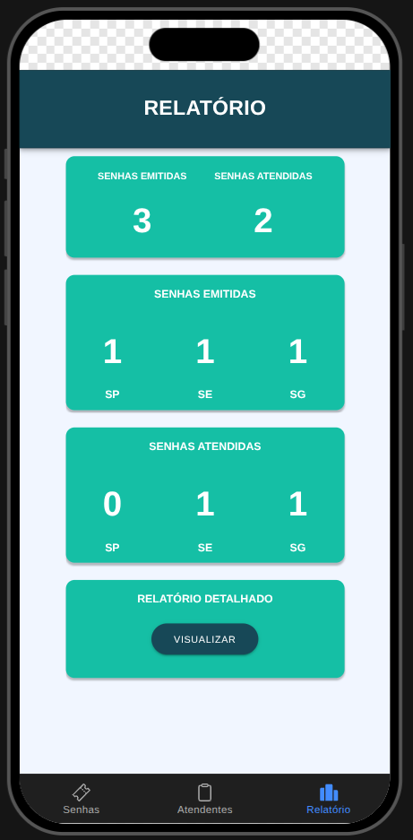
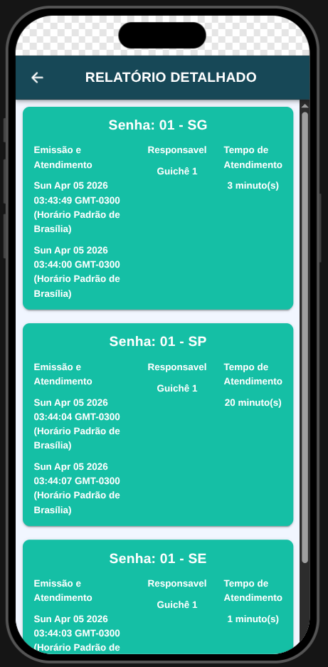

# MobileTicketsIonic

Aplicativo Ionic + Angular para emissão, atendimento e acompanhamento de senhas de atendimento (SG, SP e SE), com painel em abas e relatório detalhado.

## Visão geral

O projeto simula um fluxo de atendimento com três etapas principais:

1. Solicitação de senha pelo usuário.
2. Atendimento da próxima senha disponível por um guichê.
3. Acompanhamento de métricas e histórico no relatório.

A aplicação é estruturada em abas (`Senhas`, `Atendentes`, `Relatório`) e uma página adicional de relatório detalhado.

## Screenshots

### Tela de Senhas



### Tela de Atendentes



### Tela de Relatório



### Tela de Relatório Detalhado



## Funcionalidades

- Emissão de senhas por tipo:
  - `SG` (Geral)
  - `SP` (Prioritária)
  - `SE` (Retirada de Exames)
- Fila de atendimento com priorização por tipo de senha.
- Registro de informações de atendimento:
  - número da senha
  - tipo
  - data de emissão
  - data de atendimento
  - guichê responsável
  - tempo estimado
- Dashboard de relatório com totais emitidos e atendidos.
- Página de relatório detalhado com listagem de senhas atendidas.

## Stack e versões principais

- Angular `^20.0.0`
- Ionic Angular `^8.0.0`
- Capacitor Core/CLI `8.x`
- TypeScript `~5.9.0`
- RxJS `~7.8.0`

## Estrutura do projeto

```text
src/
  app/
    services/
      senhas.ts                   # regra de negócio das filas e relatórios
    tab1/                         # emissão de senhas
    tab2/                         # atendimento (guichê)
    tab3/                         # resumo de relatório
    relatorio-detalhado/          # histórico detalhado
    tabs/                         # navegação por abas
  environments/
  theme/
www/                              # saída do build Angular/Ionic
```

## Regras de negócio (resumo)

- As senhas são geradas com prefixo da data + tipo + sequencial.
- O atendimento percorre a ordem de prioridade definida no serviço.
- O histórico de atendimentos é armazenado em memória enquanto a aplicação está em execução.

## Pré-requisitos

- Node.js (recomendado: versão LTS)
- npm
- Ionic CLI

Instalação da CLI (caso necessário):

```bash
npm install -g @ionic/cli
```

## Como executar localmente

1. Instale as dependências:

```bash
npm install
```

2. Inicie em modo desenvolvimento:

```bash
npm run dev
```

Alternativa com Angular CLI:

```bash
npm start
```

3. Abra no navegador o endereço exibido no terminal (normalmente `http://localhost:8100` para Ionic ou `http://localhost:4200` para Angular).

## Scripts disponíveis

- `npm run dev`: inicia com `ionic serve --no-open`
- `npm start`: inicia com `ng serve`
- `npm run build`: gera build de produção em `www/`
- `npm run watch`: build em modo watch (development)
- `npm run test`: executa testes unitários (Karma/Jasmine)
- `npm run lint`: executa lint com Angular ESLint

## Build para produção

```bash
npm run build
```

Os artefatos serão gerados em `www/`.

## Capacitor (Android/iOS)

O projeto já possui integração com Capacitor (`capacitor.config.ts`).

Fluxo comum:

```bash
npm run build
npx cap sync
npx cap open android
```

Para iOS (em macOS):

```bash
npm run build
npx cap sync
npx cap open ios
```

## Testes e qualidade

```bash
npm run test
npm run lint
```

## Observações

- O estado das filas e relatórios é mantido em memória no serviço `Senhas`.
- Ao recarregar a aplicação, os dados retornam ao estado inicial.

## Licença

Este projeto está licenciado sob a licença MIT. Consulte o arquivo `LICENSE`.
